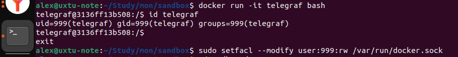
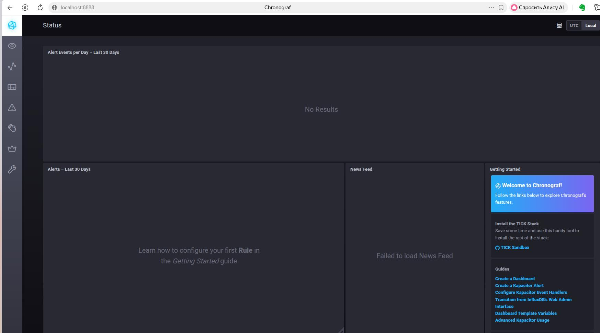
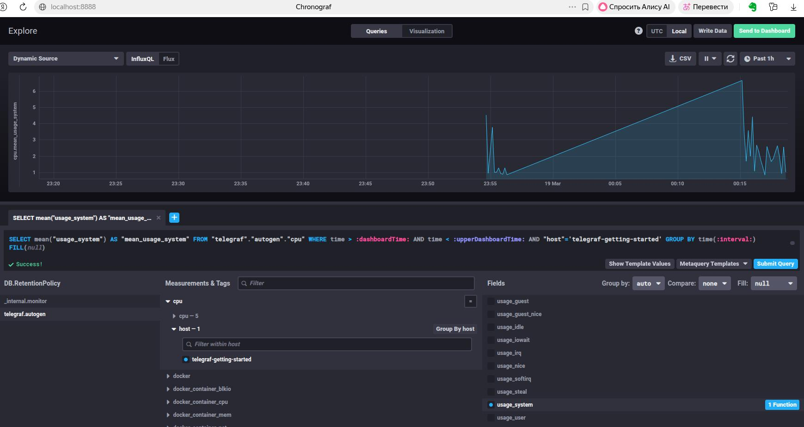

## Monitoring and Logging Homework ##  
  
### Task 1 ###  
#### Минимальный набор метрик должен включать: ####  
- CPU User
- CPU Sys
- CPU idle
- CPU iowait
- Disk busy  
- Disk queue size  
- Disk iops  
- Disk response time
- Net ops/sec  
- HTTP response time  
- HTTP ops/sec  
- HTTP 4?? + 5?? responces/sec
- HTTP 2?? + 3?? responces/sec  
Необходимо отслеживать нагрузку на CPU, так как заявлено, что процессоры сильно утилизируются.  
Необходимо так же мониторить нагрузку на диски, так как от производительности и нагруженности дисков зависит производительность при записи отчетов.  
Необходимо отслеживать отклик и количество танзакций на HTTP сервере, а так же измерять качество HTTP сервиса с помощью соотношения успешных и неуспешных кодов HTTP  
### Task 2 ###  
Можно предложить снабдить систему мониторинга:  
- переводом названия метрик на русский язык  
- графиками с базовыми линями, обозначающими нормальное состояние  
- триггерами и алертами по пороговым значениям метрик производительности  
Кроме того, можно запросить менеджера продукта, чтобы он сформулировал внутренние метрики (Whitebox) продукта, которые более понятно отображают состояние сервиса, а так же обсудить SLO, SLA и SLI для продукта, чтобы в визуализациях, картах, дашбордах окрашивать компоненты системы в заисимости от значений значимых метрик.  
### Task 3 ###  
Если нет бюджета для системы сбора логов - можно настроить:  
- Sentry для перехата ошибок  
- ELK, Graylog, loki для централизованного сбора, хранения и анализа логов    
- Jaeger, Zipkin, OpenTelemetry для диагностики межсервисного взаимодействия  
### Task 4 ###  
Ошибка в подсчетах, по всей видимости, в том, что не учитываются как успешные коды 3??  
### Task 5 ###  
Pull:  
+ позволяет централизованно назначить расписание сбора метрик  
- нагружает сервер мониторинга большим количеством сборщиков метрик, количество которых может вырости особенно в случае долгого отклика агентов или их недоступности  

Push:  
+ делает процесс сбора метрик асинхронным  
+ разгружает сервер мониторинга  
- затрудняет рагулирование интервалов сбора метрик и делает их нерегулярными  
### Task 6 ###  
Pull:  
- Prometheus

Push:  
- TICK
 
Hybryd:  

- Zabbix   
- Ngios  
- VictoriaMetrics
- 
### Task 7 ###  
Сборка отказалась подниматься через docker-compose ud -d  
Подсмотрел, что оказывается поднимать надо не с помощью утилиты docker-compose, как написано в задании, а с помощью ./sandobx up  
3 контейнера не соглашались подниматься без уговоров: пришлось поправить права на подкаталоги, которые передавались в контейнеры в качестве вольюмов.  
На Ubuntu так же возникли трудности с /var/run/docker.sock    
Подсмотрел UID telegraf в контейнере и добавил ACL на докер сокет  
  
В результате композ запустился  

  
### Task 8-9 ###  
  
В Measurements видно docker но чего-то вразумительного оттуда в плане мониторинга взять не получается - есть статическая информация будьто из inspect, а Fields никаких не увидел  

